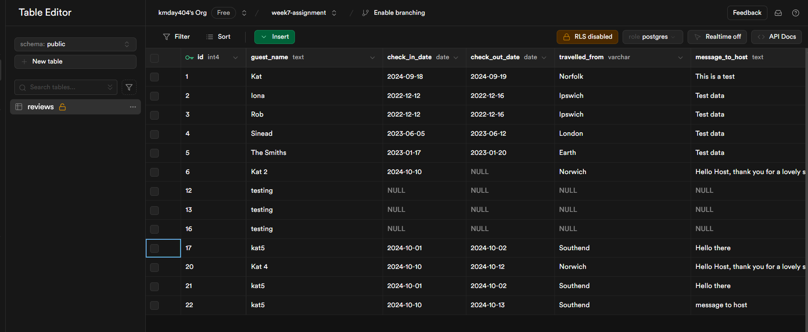
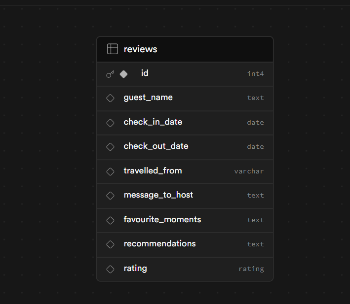

# Requirements

- Create a client using React.  
  Complete
- Use Express to create your server, using both GET and POST endpoints.  
  Complete
- Build a React form for users to create posts.  
  Complete
- Create multiple pages using React Router.  
  Complete - homepage, reviews and add-reviews.
- Design a database schema, and seed the database with some realistic data.  
  Complete. Although I didn't use my seed file in the end, I used SQL Editor and thunderclient.  
  
  
- Use SQL to retrieve posts from the database in your Express server.  
  Complete - render on refresh to the reviews page.
- Display all posts using .map().  
  Complete

I feel I have reached my MVP goals this week.

My stretch goals:

- Add images and mort text to the homepage
- Add image(s) to the header
- Enable the user to filter the reviews newest to oldest (likely by check out date age)

Styling query: p tags I made white on reviews page (Form), but in add-reviews page (FormPage) I wanted my rating (also a p tag) to be a different color. The ratings have thier own class name, I moved the import FormPage above the Form on App.jsx - unsure why they are still white.
